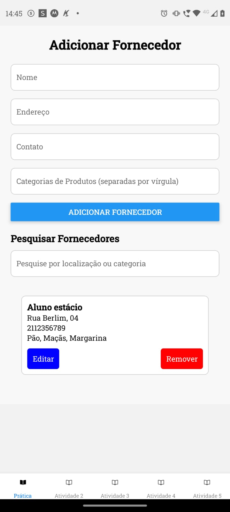
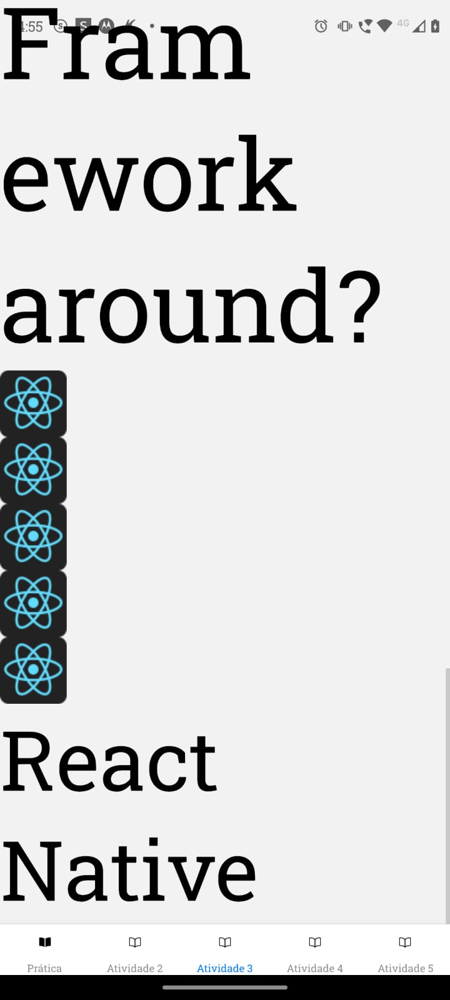
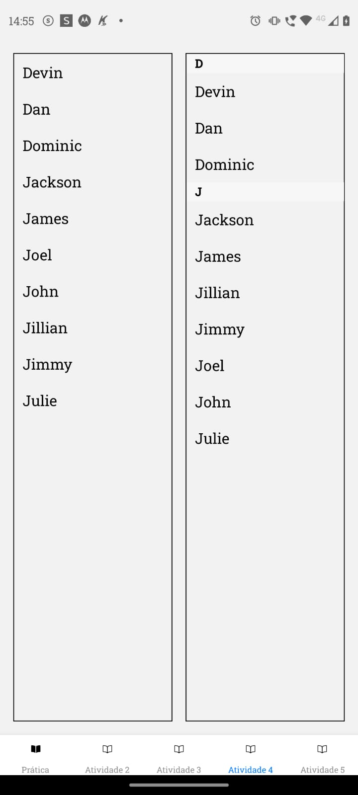
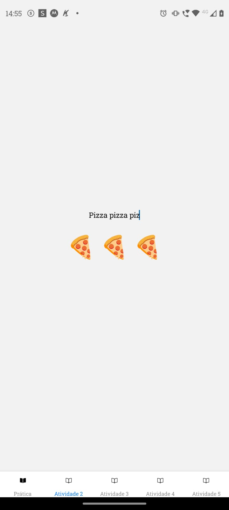
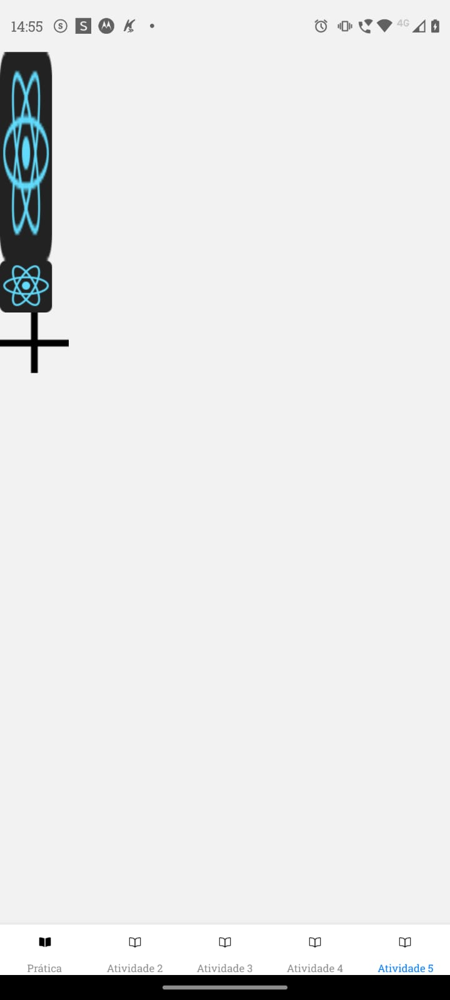

# 🌍 Atividade Prática

A atividade prática foi feita utilizando **Async Storage** para manter a persistência de dados. Foi utilizado **react-native-navigation** para ter uma navegação entre as microatividades e atividade prática do projeto. Não consegui rodar o projeto com react-native puro, portanto utilizei **Expo** para sua inicialização e funconamento.

Este projeto foi criado com base na missão prática do nível 2 (_RPG0024 - Posso criar um App de outra forma_) do Mundo 4 no curso de **Desenvolvimento Full-Stack da Estácio**.

---

## 🛠️ Stack Utilizada

**Mobile:** React Native

---

## 🧑‍💻 Pré-requisitos

Certifique-se de que você tem os seguintes itens instalados em sua máquina:

- **Node.js** e **npm**
- **Expo**
- **React Native CLI** (caso esteja usando emuladores)
- Um emulador ou dispositivo conectado para executar o aplicativo

---

## 📦 Rodando Localmente

### 1. Clone o projeto

```bash
    git clone https://github.com/Rickrasin/ESTACIO_M4_N1.git
```

```bash
    cd ESTACIO_M4_N1
```

```bash
    npm install
```

```
    npx expo build:android
```

## 📸 Screenshots






